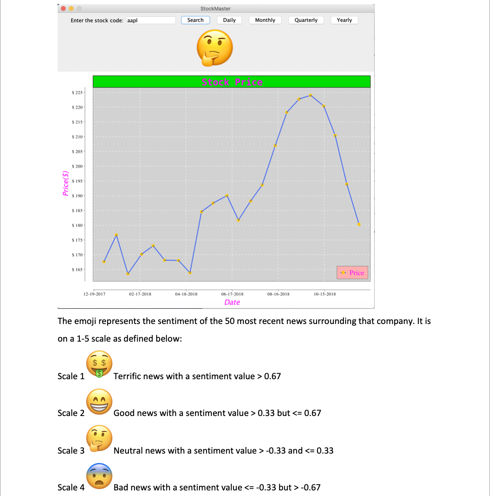
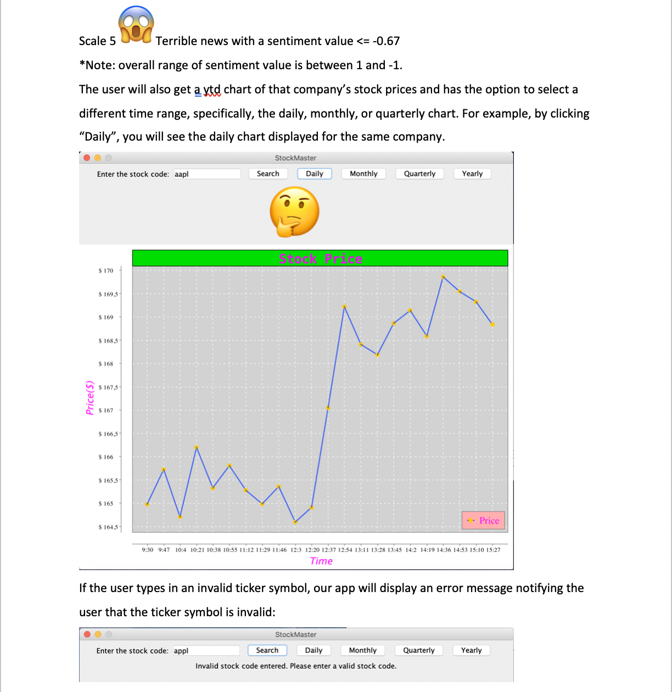
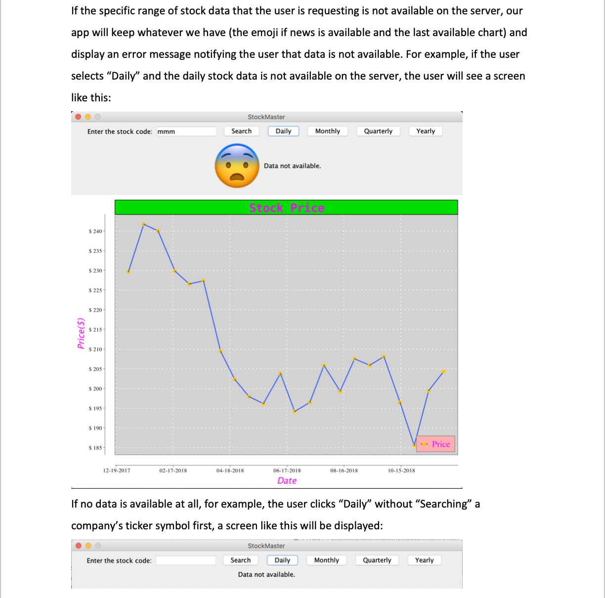

**Project name:** StockMaster

**Description:** Our app takes a ticker symbol from the user, gathers (from IEX API) and plots (ytd by default) real-time stock data of that company. It also allows the user to select a different time range and see the corresponding chart, for example, the daily, monthly or quarterly chart. We also pull the most recent 50 news surrounding that company and run a sentimental analysis on the news using IBM Watson and display an emoji according to the sentiment value we get back. Our app was tested extensively to handle all kinds of errors and display error messages accordingly.
               
**Authors:** Zhenghua (Calvin) Chen

         Shiqing (Jill) Liu
         
         Qiongying (Jennifer) Jiang
         
**Actual work breakdown:** Calvin: StockMasterGUI, integration with all other classes, front-end testing, project management.

                       Jill: StockData & NewsAnalysis, integration with DataPlot, corresponding JUnit tests.
                       
                       Jennifer: DataPlot, corresponding JUnit tests.
                       
**Link to GitHub repository:** https://github.com/calchen01/StockMaster

